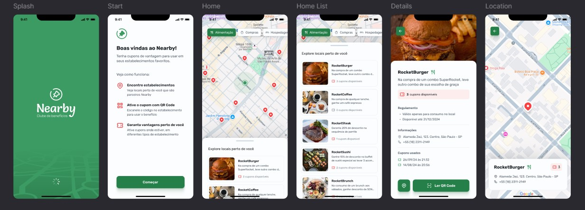

# Nearby



Nearby é uma aplicação mobile desenvolvida em React Native com Expo, que permite aos usuários descobrir e utilizar cupons de vantagens em estabelecimentos parceiros. A aplicação oferece recursos como leitura de QR code para resgate de cupons, interação com mapas para localização de estabelecimentos e uma interface amigável para explorar as ofertas disponíveis.

## Funcionalidades Principais

*   **Exploração de estabelecimentos:** Descubra estabelecimentos parceiros próximos a você.
*   **Visualização de cupons:** Navegue por cupons de desconto disponíveis em cada local.
*   **Resgate via QR code:** Utilize a câmera do seu dispositivo para escanear QR codes e ativar seus cupons.
*   **Mapas:** Veja a localização dos estabelecimentos no mapa, facilitando o seu deslocamento.
*   **Informações detalhadas:** Acesse informações sobre as ofertas.

## Tecnologias Utilizadas

*   **Frontend:**
    *   React Native
    *   Expo
*   **Backend:**
    *   Node.js
    *   Prisma

## Execução

Siga as instruções abaixo para executar o projeto em sua máquina.

### Backend (API)

1.  **Navegue até a pasta da API:**
    ```bash
    cd api
    ```
2.  **Instale as dependências:**
    ```bash
    npm install
    ```
3.  **Inicie o servidor:**
    ```bash
    npm start
    ```
    A API estará disponível na porta 3333.

### Frontend (Mobile)

1.  **Ajuste a URL da API:**
    *   Dentro da pasta `services`, localize o arquivo responsável pela configuração da API.
    *   Altere a variável `baseURL` para o IP da sua máquina, seguido pela porta 3333. Exemplo:
    ```javascript
     baseURL: "http://192.168.100.3:3333"
    ```
    **Atenção:** Substitua `192.168.100.3` pelo IP da sua máquina na rede local.
2.  **Navegue até a pasta da aplicação mobile:**
    ```bash
    cd ../mobile
    ```
3.  **Instale as dependências:**
    ```bash
    npm install
    ```
4.  **Inicie o servidor Expo:**
    ```bash
    npx expo start
    ```
5.  **Execute a aplicação:**
    *   Utilize um emulador Android ou iOS.
    *   Ou utilize o aplicativo Expo Go no seu dispositivo móvel para escanear o QR code exibido no terminal e visualize a aplicação.
